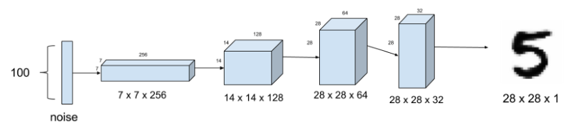
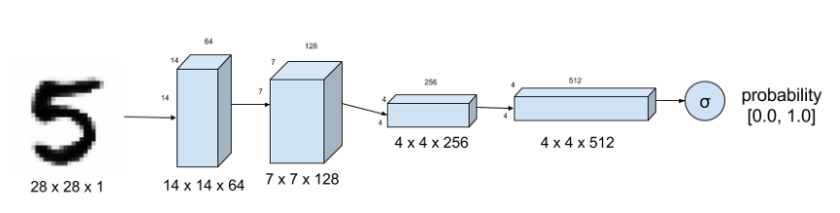
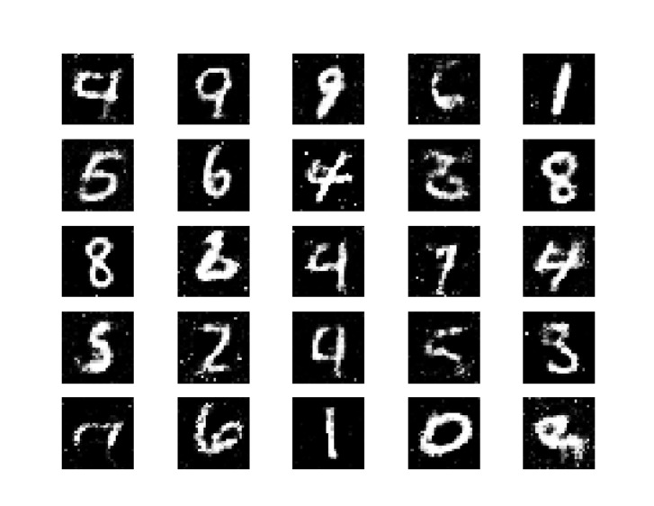
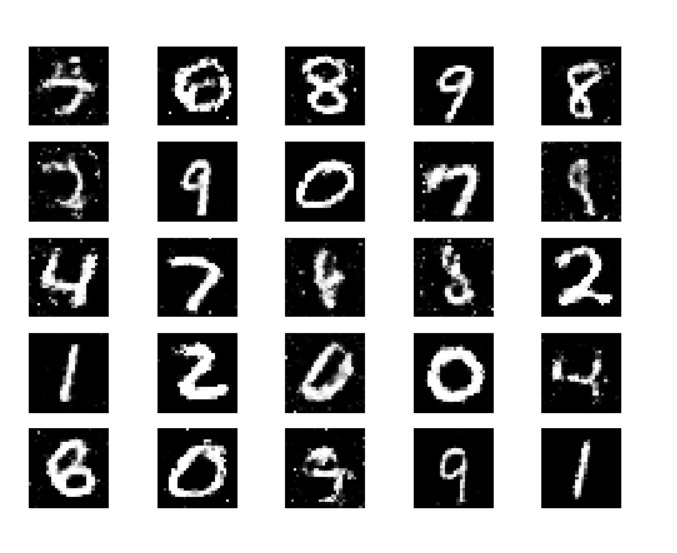

# Tensorflow GAN
A basic implementation of General Adversarial Networks using Tensorflow framework in Python. I used the mnist dataset for training my GAN and the purpose of this was to create a model which can generate numbers from random noise.

## Installation and Setup

* Fork the repo and clone it.
```
https://github.com/Frostday/Tensorflow-GAN.git
```
* Install the necessary packages required to run the code
* Run the following command
```
python GAN.py
```

## Model

Generator


Discriminator


## Explanation

We first train GAN (generator + discriminator) by inputting random noise and give output as valid while only generator weights 
will be trained (the purpose is therefore to fool the discriminator into thinking these generated images are valid).
Next we will train discriminator by inputting images obtained from generator with output - fake and also by images from 
mnist with output - valid (basically train discriminator to label images generated by generator as fake).
Therefore we set up a sort of rivalry between generator and discriminator where purpose of generator is to fool the discriminator 
and purpose of discriminator is to recognise images by generator and not get fooled.

## Results

This is the output after 10,000 epochs

| Discriminator Loss  | Discriminator Accuracy | GAN Loss       |
|:--------------------|:-----------------------|:---------------|
|0.695226             |50.38%                  |0.805460        |



This is the output after 50,000 epochs

| Discriminator Loss  | Discriminator Accuracy | GAN Loss       |
|:--------------------|:-----------------------|:---------------|
|0.657427             |55.68%                  |0.882006        |


